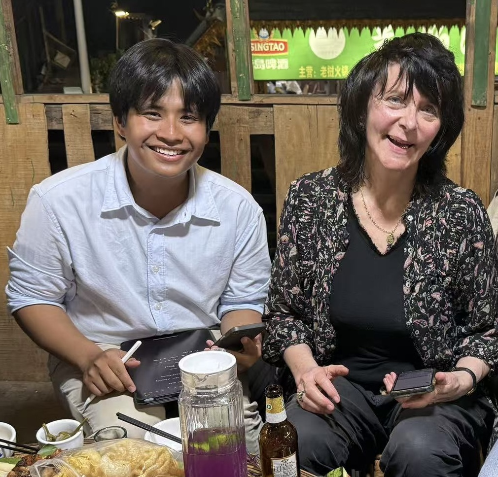
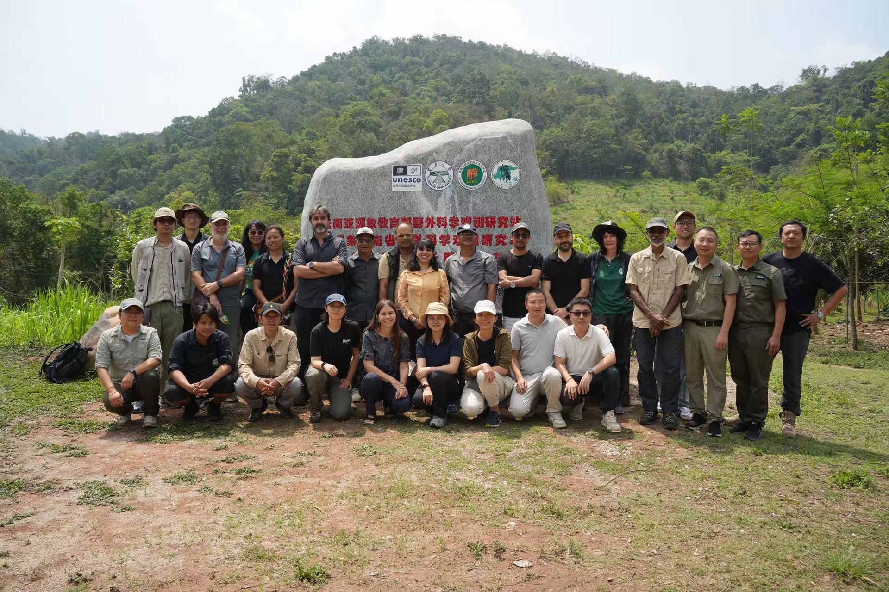
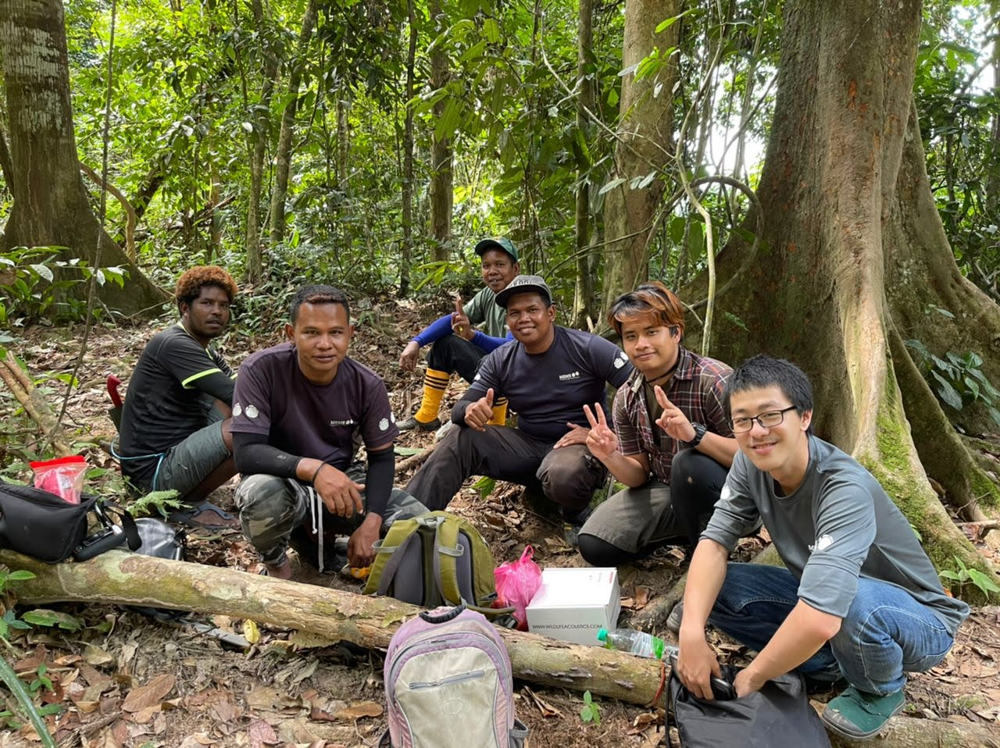
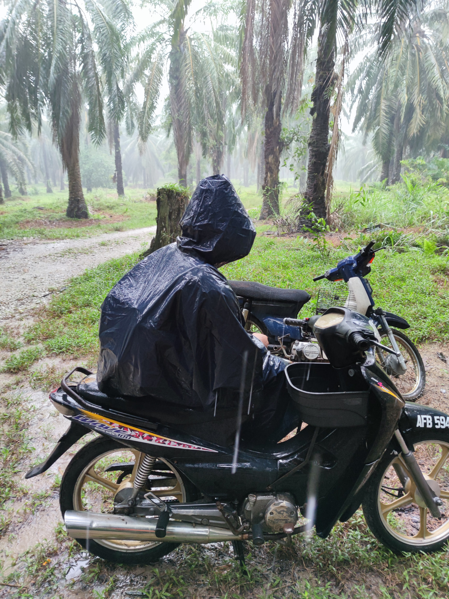

##### SUMMARY

Hi there! Welcome to my website.

###### Current
- I am from Yogyakarta, Indonesia, but spent most of my life in Kuala Lumpur, Malaysia.
- Currently studying **Master's in Ecology** at the **Xishuangbanna Tropical Botanical Garden (XTBG), Chinese Academy of Sciences**.
- Expected to graduate in **June 2026**.
- Research interests: Intersection between **human-wildlife conflict (HWC) and AI**, and **broad-scale impact of HWC**.
- **Master's Thesis**: Drivers and outlook of Elephant-caused human casualties in Tropical Asia (paper incoming!), supervised by Prof. [Ahimsa Campos-Arceiz](https://scholar.google.com/citations?user=cup55xsAAAAJ&hl=en).

###### Past
- Obtained **BSc (Hons) in Environmental Science (First Class)** from the **University of Nottingham Malaysia** in 2022.
- Worked as a research associate after my graduation, involved in the development of an elephant early warning system, meta-analysis of mangrove population genetics, and game-based conservation education project.
- **BSc Thesis**: CNN-based elephant and non-elephant sound classifier, supervised by Dr. [Ee Phin Wong](https://www.nottingham.ac.uk/news/expertiseguide/geography/dr-ee-phin-wong.aspx), Dr. [Loo Yen Yi](https://scholar.google.com/citations?user=NMHt1EsAAAAJ&hl=en), and Prof. [Tomas Maul](https://scholar.google.com/citations?user=ckZuLUgAAAAJ&hl=en).

Outside of research, I play football with the XTBG Team as a right winger (RW). I also enjoy long-distance runs and reading books, with a particular fondness towards classical literature. Authors that inspired my writing style include Anton Chekhov and Ahmad Tohari.

See my CV below:

+ [Download CV](CV-Naufal.pdf)

Notable Repositories:

+ [Elephant-caused human casualties; R](https://github.com/aalavicena/Elephant-Attacks-Asia)
+ [Deep learning-based elephant vocalizations identification; Python](https://github.com/aalavicena/Deep-Learning-Elephant-Bioacoustics)
+ [Wildlife attack data annotation from cc-news using LLMs; Python (in progress)](https://github.com/aalavicena/wildlife-attacks-news-filter)

<!--+ [Download Resume](/Resume0629.pdf)-->
##### EDUCATION
+ MSc, Ecology, Xishuangbanna Tropical Botanical Garden, CAS, 2022
+ BSc (Hons), Environmental Science, University of Nottingham Malaysia, 2019

##### SKILLS
+ Programming Language: R (terra, lme4, spaMM, etc.), Python (Tensorflow, Pytorch, Langchain, Langextract)
+ GIS & Remote Sensing: QGIS, ArcGIS Pro, Google Earth Engine, ERDAS Imagine
+ Languages: Indonesian (native), Malay (native), English (fluent), Chinese (intermediate), Javanese (beginner)

#### COURSES
+ The 8th XTBG Advanced Statistics Course, 2025

##### GRANTS & AWARDS
+ XTBG: Research Grant for Publication in High Impact Journal, 2025, ~CNY 150,000 / ~USD 21,000
+ ANSO: Master's Research Grant, 2022-2026, ~CNY 12,000 / ~USD 1,600
+ Chinese Academy of Sciences: CAS-ANSO Scholarship for Young Talents, 2022, Fully-funded scholarship to pursue degree study in China

##### GALLERY

[04/2025] Met with Prof. [Ruth Padel](https://www.ruthpadel.com) from Cambridge University and had a one-to-one session on poetry feedback :D

[04/2025] Attended Asian elephant expert meeting

[01/2022] Missing my bioacoustics project fieldwork team... picture at Belum-Temengor Forest Reserve

[??/2021] My personal favorite, waiting for rain to stop during pig-tailed macaque fieldwork in 2021. @ Segari-Melintang Forest Reserve

